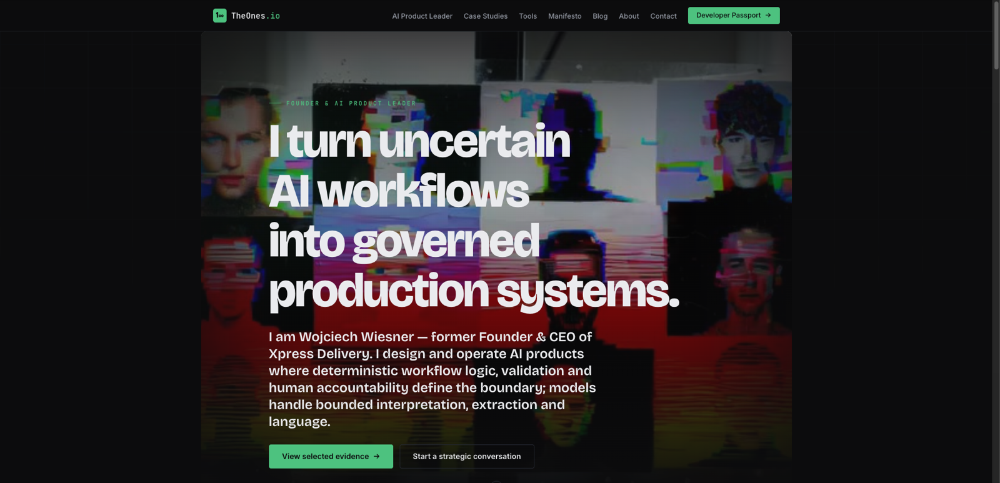
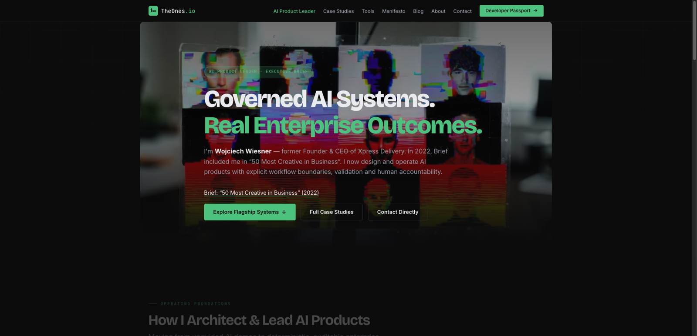
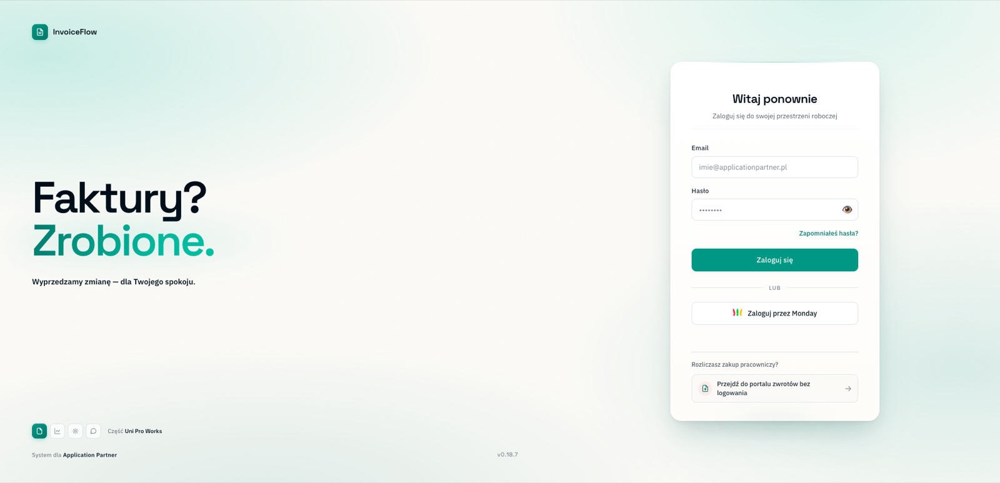
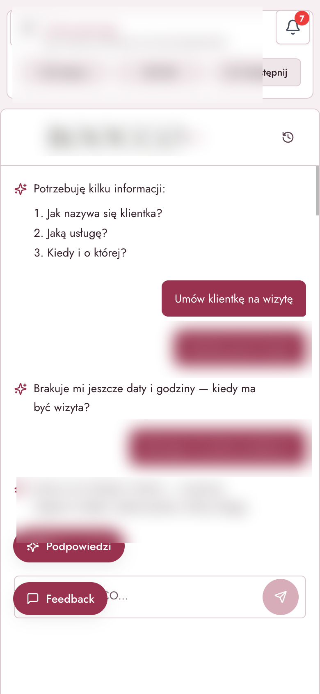
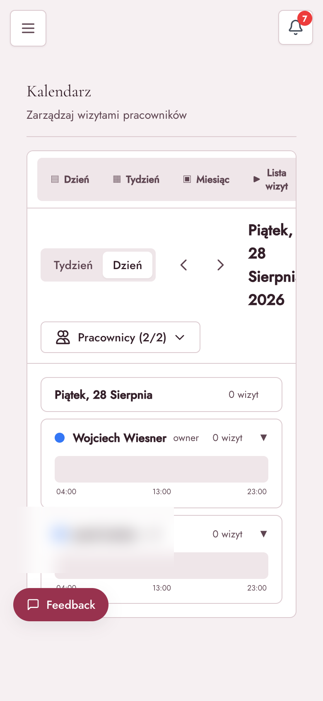
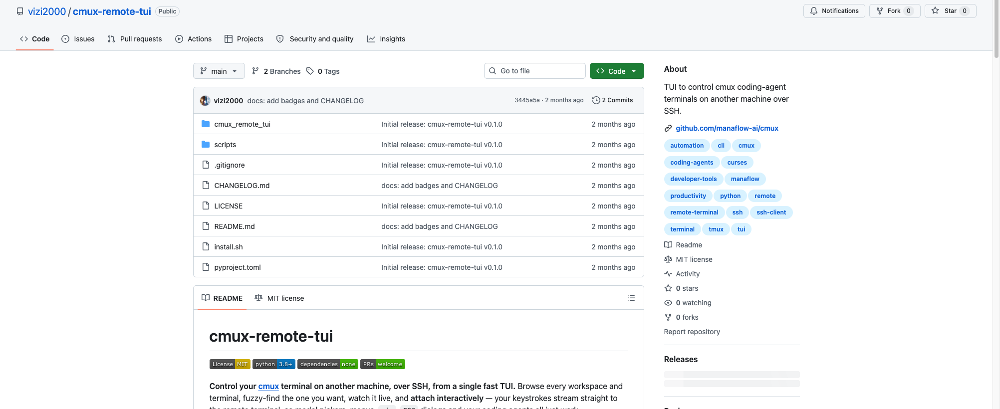
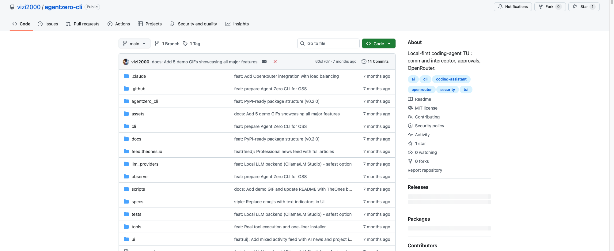

# Wojciech Wiesner

## Founding & Principal AI Systems Architect · Systems & Technology Operator

I turn ambiguous business problems into systems that can actually operate.

My background spans enterprise data, high-scale operations, company building, product leadership and hands-on AI delivery. I work best close to the business problem: understand it with decision-makers, prototype the shortest useful path, then turn what works into a production system.

Today, at **Application Partner**, I work closely with CFO / executive leadership on business problems that benefit from AI and automation — from rapid prototypes to full end-to-end product delivery.

### Scale I have operated at

**~PLN 3M raised** · **CCC Group strategic investor** · **~14k-driver network** · **61 cities + Prague** · **~20 people hired** · **~10k invoices/month** · **~1.5k automated onboardings** · **4 manufacturing sites under SAP Master Data responsibility**

---

## SOTA products (live)

Operating systems I ship — not slide decks. Screenshots from production, 2026.

### [jit-context](https://github.com/wojciechwiesner/jit-context) · [CERN Zenodo DOI: 10.5281/zenodo.22649542](https://doi.org/10.5281/zenodo.22649542)

**Flagship Architectural Moat:** An Epistemic Context Runtime & JIT OS for AI Agents.

Eliminates context needle-in-a-haystack bloat, prompt drift, and agent hallucinations through a 3-tier cascade: L0 Hot-Path SQLite WAL (<3ms Read-Your-Own-Writes), L1 Scope Hysteresis Guard (<10ms), and L2 Bounded Associative Broker. Governed by 10 strict Epistemic Invariants (I1–I10).

[](https://doi.org/10.5281/zenodo.22649542)
[](https://opensource.org/licenses/MIT)
[](https://github.com/wojciechwiesner/jit-context)
[](https://github.com/wojciechwiesner/jit-context#executive-scorecard-verified-empirical-proofs)

#### Verified Empirical Proofs (Paired Production Codebase Run — Synthapse E2E):

| Operational Metric | Standard Long-Context (Control) | JIT-Context OS (Production) | Real Impact / Delta |
| :--- | :--- | :--- | :--- |
| **Wall-Clock Task Delivery** | 9m 27s (567s) | **3m 52s (232s)** | **-59.0% (2.44x faster delivery)** |
| **LLM Inference Turns** | 171 API calls | **66 API calls** | **-61.4% (-105 rounds avoided)** |
| **Total Tool Operations** | 169 actions | **64 actions** | **-62.1% agent churn reduction** |
| **File Read Churn** | 73 reads | **24 reads** | **-67.1% less context thrashing** |
| **Runtime & Test Errors** | 8 error loops | **0 errors (clean)** | **100% first-shot error elimination** |
| **Scope Drift (Collateral Edits)**| 14 files mutated | **4 files (surgical SRP)**| **Zero scope drift** |
| **Prompt Context Size** | >50,000 tokens (Haystack) | **482 tokens (Capsule)** | **>99% token budget preserved** |
| **Read-Your-Own-Writes Latency**| 200–800ms (Vector API) | **<3ms (SQLite WAL)** | **Sub-millisecond local truth** |
| **Epistemic Self-Poisoning** | High (repeats hallucinations)| **Zero (Authority = 0.0)** | **100% grounded in runtime proofs** |

### [TheOnes.io](https://theones.io) · [AI Product Leader](https://theones.io/ai-product-leader)

Portfolio and evidence site: governed AI workflows, case studies, developer passport.

[](https://theones.io)

[](https://theones.io/ai-product-leader)

### [sota-agent-kit](https://github.com/wojciechwiesner/sota-agent-kit)

Public operating kit for coding agents (Hermes / Claude Code / OpenCode): one living `STATE.md`, verified `DONE.md` (SHA + command), VibingDiary, autocheck spots, no secrets in git.

### [Feedby](https://github.com/wojciechwiesner/feedby-public) · [widget](https://github.com/wojciechwiesner/feedby-widget)

Feedback → triage → isolated agent → **reviewable PR** (never auto-merge).

### [InvoiceFlow](https://invoiceflow.apppartner.pl) · [case](projects/invoiceflow/README.md)

**~10,000 invoices/month in production.** Business problem → prototype with finance leadership → full operating workflow.

The model extracts and classifies; deterministic rules decide what is allowed next. No model writes to the ledger unsupervised.

What it does (product, not internals): ingest documents · classify type/vendor/cost · validate against accounting rules · human approval at money boundaries · route to finance systems · keep an audit trail.

[](https://invoiceflow.apppartner.pl)

### b**c*o — AI-first salon OS (invitation-only MVP)

No public URL. Brand redacted. Private source.

The operator talks to the product in language. The assistant asks only what is missing (who / what / when), then turns intent into a booking — not a 12-field form. Suggestion chips, staff calendar, waitlist, and a feedback loop back into the product. Built as **invitation-only** while the operating loop is proven with real salons.

What is new (product, not stack): language-first operations instead of admin CRUD; the model may propose, the operator confirms; empty fields become questions, not validation errors.




### [cmux-remote-tui](https://github.com/wojciechwiesner/cmux-remote-tui) · [agentzero-cli](https://github.com/wojciechwiesner/agentzero-cli)

Operator tools I actually run: remote control of coding-agent terminals over SSH, and a local-first agent TUI with **command interception and approvals** (the model does not get a raw shell).




---

## Selected systems

### [jit-context](https://github.com/wojciechwiesner/jit-context)
**Architectural Moat: Epistemic Context Runtime & JIT OS for AI Agents.**

CERN Zenodo DOI: `10.5281/zenodo.22649542`. Real-time L0 SQLite WAL (<3ms RYOW), L1 Scope Hysteresis, L2 Bounded Retrieval, 10 Epistemic Invariants, and deterministic Autocheck Spots.

### [InvoiceFlow](projects/invoiceflow/README.md)
**~10,000 invoices/month in production.**

AI-assisted document processing wrapped in deterministic validation, business rules, approvals, routing and finance integrations.

**Pattern:** the model proposes; the system validates what is allowed to happen next.

### [Onboarding Flow](projects/onboarding-flow/README.md)
**~1,500 people processed with minimal manual intervention.**

Schema-driven onboarding automation where process state and next actions remain deterministic and LLMs are used only where language flexibility adds value.

### [UniPro](projects/unipro/README.md)
Enterprise automation architecture for turning ambiguous intent into validated plans and deterministic execution through reusable capabilities / primitives.

```text
intent → interpretation → plan → validation → controlled execution → telemetry
```

### [Feedby](https://github.com/wojciechwiesner/feedby-public)
AI-first feedback-to-change system: captures user context, triages and clusters feedback, prepares engineering context and dispatches an isolated agent that ends in a **reviewable pull request** rather than an automatic merge.

### [Xpress Delivery](projects/xpress-delivery/README.md)
Technology-enabled same-day delivery platform operated across **61 Polish cities + Prague**. I co-founded the company, hired ~20 people, raised ~PLN 3M and secured CCC Group as a strategic investor while owning product/system direction and software-delivery priorities.

---

## Public tools I actually use / built for real workflows

### [jit-context](https://github.com/wojciechwiesner/jit-context)
Epistemic Context Runtime & JIT OS for AI Agents. Sub-3ms SQLite WAL, 10 epistemic invariants, CERN Zenodo DOI.

### [cmux-remote-tui](https://github.com/wojciechwiesner/cmux-remote-tui)
Remote control plane for agent-heavy terminal workflows. Lets me monitor and interact with multiple coding-agent terminals running on an always-on machine over SSH.

### [Agent Zero CLI](https://github.com/wojciechwiesner/agentzero-cli)
Local-first coding-agent CLI with command interception, approval boundaries and multiple model backends. Packaged for PyPI.

### [Feedby Widget](https://github.com/wojciechwiesner/feedby-widget)
Embeddable feedback widget used as the client-side part of a feedback → context → AI triage → reviewable change workflow.

### [MCP Agent Bridge](https://github.com/wojciechwiesner/mcp-agent-bridge)
Bidirectional MCP bridge connecting coding-agent ecosystems and tool interfaces across different execution environments.

---

## How I build

```text
listen → decompose → model → prototype → constrain → build → automate → observe → improve
```

I use AI aggressively to compress research, prototyping and implementation time. I do **not** use it as an excuse to remove deterministic controls from consequential workflows.

I deliberately separate:

- ambiguity that benefits from probabilistic models,
- state and rules that should remain deterministic,
- actions that require validation or policy boundaries,
- decisions that should remain human.

I also run rapid 0→1 product experiments to shorten the distance between an idea and market feedback. My personal speed record is roughly **2 hours from idea → working WordPress plugin → product page → live checkout**.

---

## Background

Before AI-native product work, I spent years operating real systems at scale:

- **Application Partner** — AI Developer / product & technology operator; direct work with CFO and executive leadership; business problem discovery, rapid prototypes and end-to-end AI/automation delivery.
- **Xpress Delivery (2018–2025)** — co-founder / CEO-CVO; product and technology direction, development-team delivery, enterprise customers, fundraising and multi-city operations.
- **2016–2022** — founder/operator of a ~14k-driver logistics network and internal settlement/accounting system.
- **2 Sisters Food Group, UK (2010–2012)** — SAP Master Data Specialist with independent responsibility across four manufacturing sites.

In 2022 I was recognised by **BRIEF among the 50 Most Creative People in Business**.

---

## Links

- **Portfolio / case studies:** https://theones.io/ai-product-leader
- **LinkedIn:** https://www.linkedin.com/in/wojciechwiesner/
- **Email:** wojciech@theones.io

> Production/customer repositories remain private where they contain proprietary code or operational details. This profile intentionally highlights systems and tools that best represent how I build.
